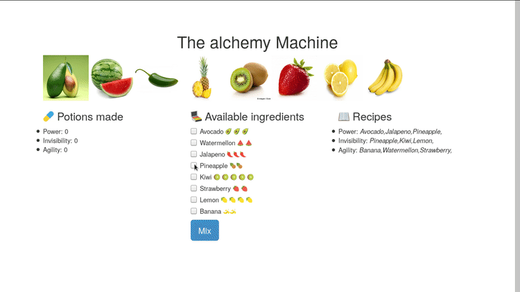

# Alchemy machine

This is an application of an alchemy machine. It uses `nodejs` as back-end and `angularjs` as frontend.
Full description of the project and the code can be found at my webpage [cristianpb.github.io](https://cristianpb.github.io/blog/alchemy-machine).



The file `core.js` contains the angularjs module, `index.html` contains the external webpage, `package.json` contains the `npm` node modules used for the application.I use [express.js](http://expressjs.com/) to create an small server which communicates javascript code in the back-end with the `index.html` file in the front-end. It is included in `server.js`, which include all javascript code executed using nodejs.

```
├── public
│   ├── core.js
│   └── index.html 
├── package.json
├── data.json
└── server.js
```

# Installation

* Make sure you have [Node](https://nodejs.org/en/) and [npm](https://www.npmjs.com/) installed
* Clone the repo: `git clone git@github.com:cristianpb/alchemy-machine.git`
* Install the application: `npm install`
* Start the server: `node server.js`
* View in your browser at http://localhost:8080
